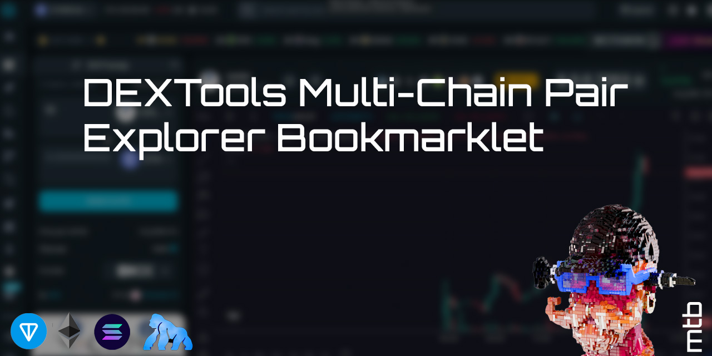

# DEXTools Multi-Chain Pair Explorer Bookmarklet



A simple, secure bookmarklet that lets you quickly look up any token pair on DEXTools. Just click the bookmark, enter a contract address, and it automatically detects the correct blockchain.

## Features
- 🔍 Quick token pair lookup
- 🔗 Direct access to DEXTools explorer
- 🔒 No external dependencies
- ⛓️ Automatic chain detection
- 💻 Works on all major browsers

## Supported Chains
- Ethereum (0x addresses)
- Apechain (0x addresses)
- TON (EQ/UQ addresses)
- Solana (All other address formats)

## Installation

1. Show your browser's bookmarks bar:
   - **Windows/Linux**: Press `Ctrl + Shift + B`
   - **Mac**: Press `⌘ + Shift + B`

2. Right-click the bookmarks bar and select "Add page" or "Add bookmark"

3. Configure the bookmark:
   - **Name**: "DEXTools Explorer" (or your preferred name)
   - **URL**: Copy and paste the code below:
```javascript
javascript:void(function(){const a=prompt("Enter the contract address:");if(!a||!a.trim())return;const b=a.trim();let c;if(b.startsWith("0x")&&42===b.length){const a=prompt("Type 1 for Apechain or 2 for Ethereum:");c="1"===a?"apechain":"2"===a?"ether":void 0;if(!c)return}else if(b.startsWith("EQ")||b.startsWith("UQ")){c="ton"}else c="solana";window.open(`https://www.dextools.io/app/en/${c}/pair-explorer/${b}`,"_blank")})();
```

## Usage

1. Click the bookmarklet
2. Enter any token contract address
3. For 0x addresses, you'll be prompted to choose between Apechain (1) or Ethereum (2)
4. TON addresses (starting with either "EQ" or "UQ") are automatically detected
5. Get redirected to DEXTools with the correct chain automatically selected

## Security
- ✅ Code is open source and can be inspected
- ✅ Only connects to official DEXTools website
- ✅ No data collection or storage
- ✅ No external API calls

## Support

Found a bug or need help? [Open an issue](https://github.com/mtb-io/dextools-bookmarklet/issues)

## License

MIT License - feel free to modify and reuse

## Author

Built by [mtb](https://x.com/LiverpoolMTB) on X
