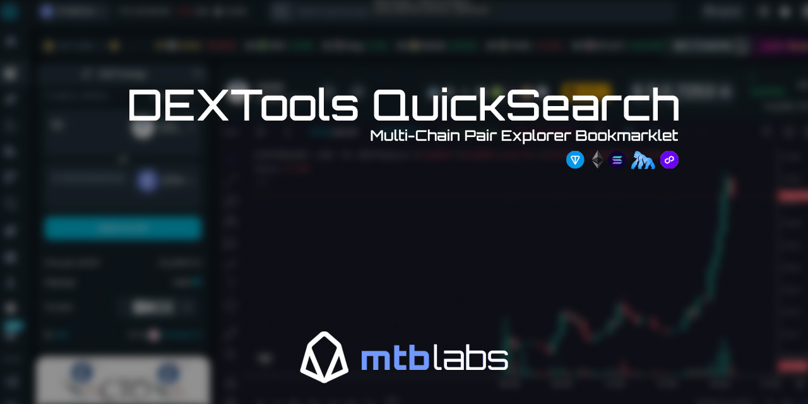

# DEXTools QuickSearch 🔍



🏷️ v0.0.1

A simple, secure bookmarklet that lets you quickly look up any token pair on DEXTools. Just click the bookmark, enter a contract address, and it automatically detects the correct blockchain.

## Quick Start ⚡
1. Add the bookmarklet to your browser (instructions below)
2. Click it and enter a contract address like: `0x1234...` or `EQxyz...`
3. Get redirected to DEXTools with the correct chain automatically detected

## Features ✨
- 🔍 Quick token pair lookup
- 🔗 Direct access to DEXTools explorer
- 🔒 No external dependencies
- ⛓️ Automatic chain detection
- 💻 Works on Chrome, Firefox, Brave, and Safari
- 🚀 Lightweight (<1KB)

## Supported Chains ⛓️
- Ethereum (0x addresses)
- Apechain (0x addresses)
- Polygon (0x addresses)
- TON (EQ/UQ addresses)
- Solana (All other address formats)

## Installation 📥

First, show your browser's bookmarks bar:
- **Windows/Linux**: Press `Ctrl + Shift + B`
- **Mac**: Press `⌘ + Shift + B`

Choose the correct snippet for your browser:

### Chromium-based (Chrome/Brave/Firefox) 
<details>
<summary>Click to show code (dex-chromium.js)</summary>

```javascript
javascript:void(function(){const t=prompt("Enter the contract address:");if(!t||!t.trim())return;const r=t.trim();let n;if(r.startsWith("0x")&&42===r.length){const t=prompt("Type 1 for Apechain, 2 for Ethereum, or 3 for Polygon:");if(n="1"===t?"apechain":"2"===t?"ether":"3"===t?"polygon":void 0,!n)return}else n=r.startsWith("EQ")||r.startsWith("UQ")?"ton":"solana";window.open(`https://www.dextools.io/app/en/${n}/pair-explorer/${r}`,"_blank")})();
```
</details>

### Safari
<details>
<summary>Click to show code (dex-safari.js)</summary>

```javascript
javascript:(function(){const a=prompt("Enter the contract address:");if(!a||!a.trim())return;const b=a.trim();let c;if(b.startsWith("0x")&&42===b.length){const a=prompt("Type 1 for Apechain, 2 for Ethereum, or 3 for Polygon:");if(c="1"===a?"apechain":"2"===a?"ether":"3"===a?"polygon":null,!c)return}else c=b.startsWith("EQ")||b.startsWith("UQ")?"ton":"solana";location.href=`https://www.dextools.io/app/en/${c}/pair-explorer/${b}`})();
```
</details>

### Installation Steps:
1. Right-click your bookmarks bar and select "Add Page" or "Add Bookmark"
2. Name it "DEXTools Search" (or whatever you prefer)
3. Copy the code snippet for your browser and paste it in the URL/Location field
4. Save the bookmark

## Usage 🔧
1. Click the bookmarklet
2. Enter any token contract address
3. For 0x addresses, you'll be prompted to choose between:
   - Type `1` for Apechain
   - Type `2` for Ethereum
   - Type `3` for Polygon
4. TON addresses (starting with either "EQ" or "UQ") are automatically detected
5. Solana addresses (any other format) are automatically detected
6. Get redirected to DEXTools with the correct chain automatically selected

## Security 🔒
- ✅ Code is open source and can be inspected
- ✅ Only connects to official DEXTools website
- ✅ No data collection or storage
- ✅ No external API calls

## Support 💬

Found a bug or need help? [Open an issue](https://github.com/mtb-io/dextools-bookmarklet/issues)

## Author 👨‍💻

Built by [mtb labs](https://mtblabs.io)

## License ⚖️

MIT License

Copyright (c) 2024 mtb labs

Permission is hereby granted, free of charge, to any person obtaining a copy
of this software and associated documentation files (the "Software"), to deal
in the Software without restriction, including without limitation the rights
to use, copy, modify, merge, publish, distribute, sublicense, and/or sell
copies of the Software, and to permit persons to whom the Software is
furnished to do so, subject to the following conditions:

The above copyright notice and this permission notice shall be included in all
copies or substantial portions of the Software.

THE SOFTWARE IS PROVIDED "AS IS", WITHOUT WARRANTY OF ANY KIND, EXPRESS OR
IMPLIED, INCLUDING BUT NOT LIMITED TO THE WARRANTIES OF MERCHANTABILITY,
FITNESS FOR A PARTICULAR PURPOSE AND NONINFRINGEMENT. IN NO EVENT SHALL THE
AUTHORS OR COPYRIGHT HOLDERS BE LIABLE FOR ANY CLAIM, DAMAGES OR OTHER
LIABILITY, WHETHER IN AN ACTION OF CONTRACT, TORT OR OTHERWISE, ARISING FROM,
OUT OF OR IN CONNECTION WITH THE SOFTWARE OR THE USE OR OTHER DEALINGS IN THE
SOFTWARE.
